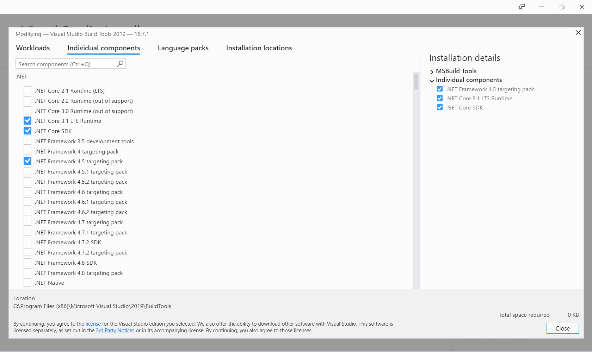

# Build

## Requirements

[git](https://git-scm.com/) 

[PowerShell](https://docs.microsoft.com/ko-kr/powershell/)

## .NET Core 3.1 Build

[.NET Core SDK 3.1](https://dotnet.microsoft.com/download/dotnet-core/3.1)

## .NET Framework 4.5 Build (Optional)

[Visual Studio 2019 Community or Build Tools for Visual Studio 2019](https://visualstudio.microsoft.com/ko/downloads/)

